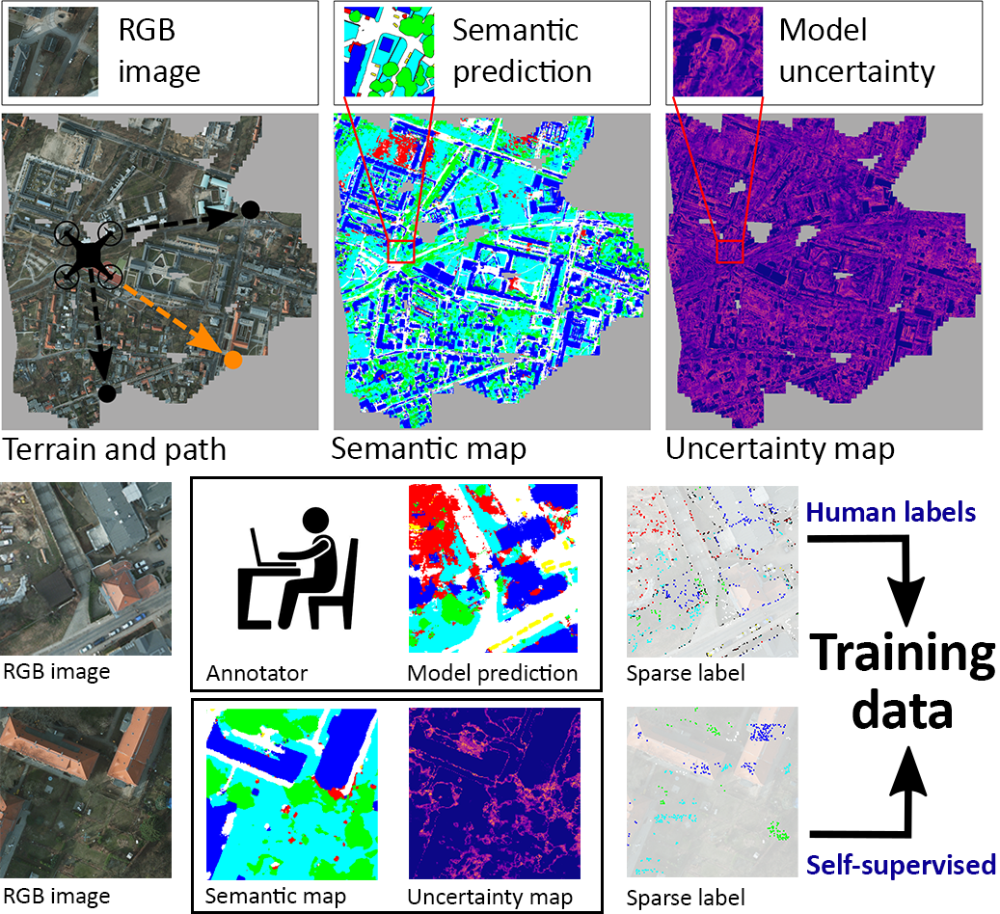

# Modification to original solution

Instead of ERFNet the SegFormer implementation is used. The implementation is taken from [here](https://github.com/NVlabs/SegFormer?tab=readme-ov-file). It either can be trained using the pipeline provided via link or just pretrained weights can be downloaded either from NVlabs's [sources](https://github.com/NVlabs/SegFormer) or from [here](https://github.com/sithu31296/semantic-segmentation).

# Semi-Supervised Active Learning for Semantic Segmentation in Unknown Environments Using Informative Path Planning

Semantic segmentation enables robots to perceive and reason about their environments beyond geometry. 
Most of such systems build upon deep learning approaches. As autonomous robots are commonly deployed 
in initially unknown environments, pre-training on static datasets cannot always capture the variety 
of domains and limits the robot’s perception performance during missions. Recently, self-supervised 
and fully supervised active learning methods emerged to improve a robot’s vision. These approaches rely 
on large in-domain pre-training datasets or require substantial human labelling effort. We propose a 
planning method for semi-supervised active learning of semantic segmentation that substantially reduces 
human labelling requirements compared to fully supervised approaches. We leverage an adaptive map-based 
planner guided towards the frontiers of unexplored space with high model uncertainty collecting training 
data for human labelling. A key aspect of our approach is to combine the sparse high-quality human labels 
with pseudo labels automatically extracted from highly certain environment map areas. Experimental results 
show that our method reaches segmentation performance close to fully supervised approaches with drastically 
reduced human labelling effort while outperforming self-supervised approaches.

## System Overview



Our semi-supervised active learning approach in an unknown environment (top). We infer semantic 
segmentation (top-centre) and model uncertainty (top-right) and fuse both in environment maps. 
The robot re-plans its path (orange, top-left) to collect diverse uncertain images. After each 
mission, we select sparse sets of pixels for human and self-supervised labelling (bottom). 
Self-supervised labels are rendered from low-uncertainty semantic map regions. Human labels are 
queried for regions of cluttered model predictions.


During a mission, a semantic segmentation network predicts pixel-wise semantics and model 
uncertainties from an RGB-D image. Both are fused into an uncertainty-aware semantic environment 
map. Our planner guides the collection of training data for network re-training
based on the robot state and map belief). After a mission, the collected data 
is labelled using two sources of annotations: (i) a human annotator labels a sparse set of 
informative pixels, and (ii) we automatically render pseudo labels from the semantic map in an 
uncertainty-aware fashion.

## Manual Setup & Installation 

### Prerequisites

1. Optional: Create a *set_credentials.sh* script with the following lines to enable usage of the provided Telegram and Slack experiment bots:
```commandline
export TELEGRAM_CHAT_ID=<YOUR_TELEGRAM_CHAT_ID>
export TELEGRAM_TOKEN=<YOUR_TELEGRAM_TOKEN>
export SLACK_TOKEN=<YOUR_SLACK_TOKEN>
export SLACK_BOTNAME=<YOUR_SLACK_BOTNAME>
export SLACK_WEBHOOK=<YOUR_SLACK_WEBHOOK>
```

Learn how to set up your own Slack webhook [here](https://api.slack.com/messaging/webhooks). Learn to setup your own Telegram bot [here](https://core.telegram.org/bots/tutorial).


### Install Repository

1. Clone repo and initialize submodules:
```commandline
git clone git@github.com:dmar-bonn/ipp-ssl.git
cd ipp-ssl
git submodule update --init
pip3 install -r bayesian_erfnet/requirements.txt
pip3 install -r requirements.txt
```
2. Download orthomosaics, generated train-val-test splits, and pretrained Bayesian ERFNet:
```commandline
./download_data.sh
```
3. Run the semi-supervised learning pipeline:

3.1. Set environment variables in terminal:
```commandline
export PYTHONPATH=$(pwd):$(pwd)/bayesian_erfnet/
source set_credentials.sh (optional)
```

3.2. Execute framework with orthomosaic-based simulator
```commandline
python3 main.py --config_file config/<CONFIG-FILE>.yaml
```

## Docker Setup

Create directory for this project in current working directory and clone this repository:

```commandline
mkdir tro_project
cd tro_project
git clone --recurse-submodules git@github.com:dmar-bonn/ipp-ssl.git
cd ipp-ssl/
```

Build docker image for this project:
```commandline
cd ../../
docker build -t ssl_ipp:ral .
```

Download orthomosaics, generated train-val-test splits, and pretrained ERFNet:
```commandline
./download_data.sh
```

Run planning pipeline in a docker container with NVIDIA GPU acceleration:
```commandline
docker run --rm --gpus all -v $(pwd):/ipp-ssl/ -it ssl_ipp:ral bash -c "cd /ipp-ssl/ && source source_envs.sh && python3 main.py"
```

or without NVIDIA GPU acceleration:
```commandline
docker run --rm -v $(pwd):/ipp-ssl/ -it ssl_ipp:ral bash -c "cd /ipp-ssl/ && source source_envs.sh && python3 main.py"
```

The pipeline executes the number of missions specified in *config/config.yaml*.
All config files are saved to the disk. During a mission, the collected train data is saved to the disk.
After each mission, the map, the planned path, and the evaluation metrics of the retrained model
are saved to the disk.

## Customized Usage of Framework

If you would like to use the framework with your own pre-trained Bayesian ERFNet, orthomosaic or train-val-test data split, follow the steps below.  

1. Download and unpack your custom orthomosaic, e.g. [Potsdam](https://www.isprs.org/education/benchmarks/UrbanSemLab/2d-sem-label-potsdam.aspx).
2. Pre-train your Bayesian-ERFNet model on a semantic segmentation dataset, e.g. Cityscapes, as described [here](https://github.com/dmar-bonn/bayesian_erfnet).
3. Generate a train-validation-test image split of your custom orthomosaic as described in the subsection below.
4. Empty the *training_set/human/images* and *training_set/human/anno* folder of your generated dataset split.
5. Adapt the *path_to_checkpoint* in your *config/&lt;CONFIG-FILE&gt;.yaml* to your model checkpoint path.

### Generate Custom Data Split

1. Adapt the *path_to_orthomosaic* and *path_to_anno* attributes in your *config/&lt;CONFIG-FILE&gt;.yaml* file to your orthomosaic RGB and Labels directories.
2. Adapt the *path_to_dataset* in your *bayesian_erfnet/agri_semantics/config/&lt;MODEL-CONFIG-FILE&gt;.yaml* file to the dataset directory path.
3. Set environment variables in terminal:
```commandline
export PYTHONPATH=$(pwd):$(pwd)/bayesian_erfnet/
source set_credentials.sh (optional)
```
3. Execute the dataset generator for orthomosaic-based simulator
```commandline
python3 dataset_generator.py --config_file config/<CONFIG-FILE>.yaml --dataset_folder <DATASET-FOLDER> --num_data_samples <NUM-DATA-SAMPLES>
```

where *<DATASET-FOLDER>* is either 'training_set', 'validation_set' or 'test_set', and *<NUM-DATA-SAMPLES>* is the number of to be generated image-annotation data points.

## Development

### Style Guidelines

In general, we follow the Python [PEP 8](https://www.python.org/dev/peps/pep-0008/) style guidelines. Please install [black](https://pypi.org/project/black/) to format your python code properly.
To run the black code formatter, use the following command:

```commandline
black -l 120 path/to/python/module/or/package/
```

To optimize and clean up your imports, feel free to have a look at this solution for [PyCharm](https://www.jetbrains.com/pycharm/guide/tips/optimize-imports/).

### Maintainer

Julius Rückin, [jrueckin@uni-bonn.de](mailto:jrueckin@uni-bonn.de), Ph.D. student at [PhenoRob - University of Bonn](https://www.phenorob.de/)

## Funding

This work was funded by the Deutsche Forschungsgemeinschaft (DFG, German Research Foundation) under 
Germany’s Excellence Strategy - EXC 2070 – 390732324. Authors are with the Cluster of Excellence PhenoRob,
Institute of Geodesy and Geoinformation, University of Bonn.
